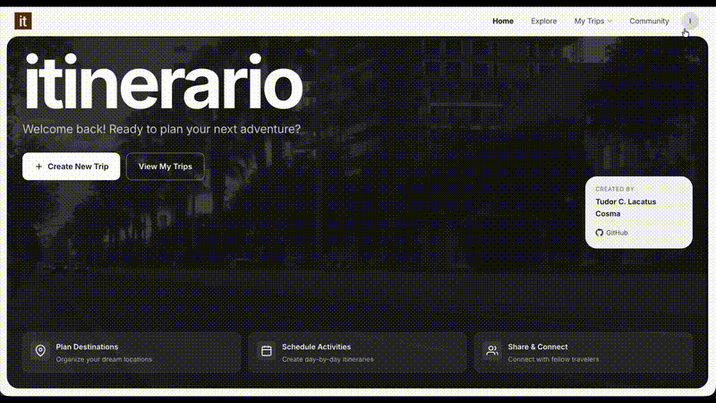

# Itinerario

<div align="center">

**Microservices Architecture - Travel Planning Platform**

[](https://github.com/lacatu5/itinerario/actions)
[](https://codecov.io/gh/lacatu5/itinerario)
[](https://www.python.org/)
[](https://react.dev/)
[](https://fastapi.tiangolo.com/)
[](https://www.docker.com/)

*A cloud-native microservices platform with polyglot persistence, real-time messaging, and container orchestration*

[Architecture](./docs/ARCHITECTURE.md) • [Deployment](./docs/DEPLOYMENT.md) • [Features](./docs/FEATURES.md)

</div>

---

## Background

This project started as coursework for the **Cloud Computing** course at **HTWG Konstanz**. I built it locally first, then refactored it to run on GKE with Terraform and added CI/CD pipelines.

The platform implements:

- **Infrastructure as Code** - Terraform for reproducible deployments
- **DevOps Automation** - CI/CD pipelines with GitHub Actions
- **Container Orchestration** - Kubernetes (GKE) and Helm charts
- **Polyglot Persistence** - PostgreSQL, Firestore, and Cloud Storage
- **Microservices Patterns** - Service decomposition, async communication, authentication
- **Quality Engineering** - Testing strategies, linting, security scanning

The features were kept simple so I could focus on learning microservices patterns and Kubernetes.

---

## Quick Start

```bash
# 1. Clone and configure environment
git clone https://github.com/lacatu5/itinerario
cd itinerario
cp .env.example .env
# Edit .env with your credentials

# 2. Start all services
docker compose up -d

# 3. Access the application
# Frontend: http://localhost:5173
# API docs: http://localhost:8001/docs (User Service)
```

[See Deployment Guide](./docs/DEPLOYMENT.md) for production setup and manual deployment process.

---

## Features Overview

<p align="center">
  
</p>

Interactive trip planning with map-based location selection, real-time travel alerts, destination management, and social features (share trips, chat, smart search).

[View Complete UI Documentation](./docs/FEATURES.md)


---

## Documentation Index

| Document | Description |
|----------|-------------|
| [Architecture](./docs/ARCHITECTURE.md) | System design, microservices breakdown, data schemas, communication patterns |
| [Deployment](./docs/DEPLOYMENT.md) | Local development setup, production deployment (GKE), CI/CD pipelines |
| [Features](./docs/FEATURES.md) | UI/UX documentation with screenshots mapped to code components |
| [Quality](./docs/QUALITY.md) | Testing strategy, code quality standards, known limitations |

---

## Technology Stack

| Layer | Technologies |
|-------|--------------|
| **Frontend** | React 19, Vite 7, TypeScript, React Router v7, Leaflet, Firebase SDK |
| **Backend** | Python 3.11+, FastAPI, SQLAlchemy 2.0, Pydantic, pytest |
| **Data** | PostgreSQL 15, Firestore (NoSQL), Cloud Storage |
| **Real-time** | Centrifugo WebSocket |
| **Infrastructure** | Docker, Kubernetes (GKE Autopilot), Terraform, Helm |

---

## Key Patterns

- **Microservices Decomposition** - Service-specific databases, shared core library
- **Async/Await Throughout** - Full async stack from FastAPI to SQLAlchemy
- **Polyglot Persistence** - PostgreSQL for relational, Firestore for documents, Cloud Storage for files
- **Infrastructure as Code** - Terraform modules for reproducible deployments
- **CI/CD Automation** - GitHub Actions with per-service linting, testing, and security scanning

---

## Project Structure

```
itinerario/
├── services/
│   ├── user-service/          # User profiles, auth (PostgreSQL)
│   ├── itinerary-service/     # Trip planning (PostgreSQL)
│   ├── chat-service/          # Real-time messaging (Firestore)
│   ├── social-service/        # Likes, follows (Firestore)
│   ├── alerts-service/        # Travel warnings (Firestore)
│   ├── destinations-service/  # Places, offers (Firestore)
│   └── frontend-service/      # React web app
├── infra/                     # Terraform modules
├── helm/                      # Kubernetes charts
├── .github/workflows/         # CI/CD pipelines
└── docs/                      # This documentation
```

---

## Development

```bash
# Run tests
make test

# Lint code
ruff check .
ruff format .

# Validate infrastructure
terraform -chdir=infra plan -var-file=environments/staging.tfvars
```

[See Quality Guide](./docs/QUALITY.md) for testing strategy and code quality standards.
