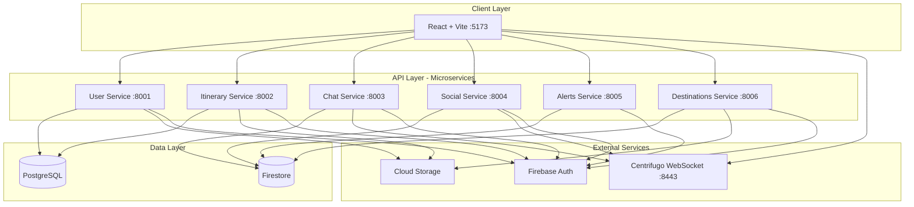

# Itinerario - Architecture Documentation

## Table of Contents

- [1. System Overview](#1-system-overview)
  - [1.1. Business Context](#11-business-context)
  - [1.2. Architecture Principles](#12-architecture-principles)
  - [1.3. Technology Stack](#13-technology-stack)
- [2. Microservices Architecture](#2-microservices-architecture)
  - [2.1. Service Breakdown](#21-service-breakdown)
  - [2.2. Data Architecture](#22-data-architecture)
  - [2.3. Communication Patterns](#23-communication-patterns)
- [3. Infrastructure](#3-infrastructure)
  - [3.1. Container Orchestration](#31-container-orchestration)
  - [3.2. Data Stores](#32-data-stores)
  - [3.3. External Services](#33-external-services)

---

## 1. System Overview

Itinerario is a travel planner that uses a microservices architecture to handle trip planning, real-time collaboration, and social features.

### 1.1. Business Context

The platform lets users create itineraries, share trips, and receive travel alerts. It uses microservices patterns with polyglot persistence (PostgreSQL, Firestore), CI/CD pipelines, and container orchestration.

### 1.2. Architecture Principles

**Microservices** - Each service is independently deployable and scalable, with isolated business logic and data.

**Polyglot Persistence** - Using multiple database technologies based on data characteristics:
- PostgreSQL for structured, relational data requiring ACID transactions
- Firestore for flexible, document-based data with real-time sync capabilities

**Direct API Access** - Services expose REST APIs directly to the frontend. Ingress uses Gateway API in GKE; Docker Compose handles local routing.

**Shared Nothing** - Services communicate via APIs and messaging, with no direct database access between services.

**Infrastructure as Code** - All infrastructure defined in Terraform and Helm for reproducibility.

### 1.3. Technology Stack

| Layer | Technology |
|-------|-----------|
| **Backend Framework** | FastAPI, Python 3.11+ |
| **Databases** | PostgreSQL 15, Firestore |
| **Authentication** | Firebase Admin SDK |
| **Real-time** | Centrifugo v5 WebSocket |
| **Storage** | Google Cloud Storage |
| **Containers** | Docker |
| **Orchestration** | GKE Autopilot |
| **IaC** | Terraform |
| **Package Management** | Helm |

---

## 2. Microservices Architecture

### 2.1. System Architecture Diagram



### 2.2. Service Breakdown

| Service | Responsibility | Database | Internal Port | External Port |
|---------|---------------|----------|---------------|---------------|
| **User Service** | User profiles, authentication, profile images | PostgreSQL | 8000 | 8001 |
| **Itinerary Service** | Travel plans, locations, transport details | PostgreSQL | 8000 | 8002 |
| **Chat Service** | Real-time messaging between users | Firestore | 8000 | 8003 |
| **Social Service** | Likes, follows, social interactions | Firestore | 8000 | 8004 |
| **Travel Alerts Service** | Weather alerts, travel warnings, flight tracking | Firestore | 8000 | 8005 |
| **Destinations Service** | Place information, ads, discounts, offers | Firestore | 8000 | 8006 |
| **Frontend Service** | Web application (React + Vite) | N/A | 5173 | 5173 |

**Note:** All backend services expose port 8000 internally. Docker Compose maps these to external ports 8001-8006 for local development.

### 2.3. Data Architecture

#### PostgreSQL Schema

**User Service:**
```sql
users (
  id SERIAL PRIMARY KEY,
  firebase_uid VARCHAR(255) UNIQUE NOT NULL,
  name VARCHAR(100) NOT NULL,
  email VARCHAR(255) UNIQUE NOT NULL,
  username VARCHAR(50) UNIQUE,
  profile_image_url VARCHAR(500),
  created_at TIMESTAMP DEFAULT NOW(),
  updated_at TIMESTAMP
)
```

**Itinerary Service:**
```sql
itineraries (
  id SERIAL PRIMARY KEY,
  title VARCHAR(200) NOT NULL,
  destination VARCHAR(200) NOT NULL,
  start_date DATE NOT NULL,
  end_date DATE,
  short_description VARCHAR(80) NOT NULL,
  detail_description VARCHAR(5000) NOT NULL,
  image_url VARCHAR(500),
  latitude VARCHAR(50),
  longitude VARCHAR(50),
  address VARCHAR(500),
  owner_id INTEGER NOT NULL,
  created_at TIMESTAMP DEFAULT NOW()
)

locations (
  id SERIAL PRIMARY KEY,
  name VARCHAR(200) NOT NULL,
  short_description VARCHAR(500) NOT NULL,
  from_date DATE NOT NULL,
  to_date DATE NOT NULL,
  image_url VARCHAR(500),
  latitude VARCHAR(50),
  longitude VARCHAR(50),
  address VARCHAR(500),
  itinerary_id INTEGER NOT NULL REFERENCES itineraries(id),
  created_at TIMESTAMP DEFAULT NOW()
)

transports (
  id SERIAL PRIMARY KEY,
  type VARCHAR(50) NOT NULL,
  departure_location VARCHAR(200) NOT NULL,
  arrival_location VARCHAR(200) NOT NULL,
  departure_time TIMESTAMP NOT NULL,
  arrival_time TIMESTAMP NOT NULL,
  carrier VARCHAR(100),
  transport_number VARCHAR(50),
  itinerary_id INTEGER NOT NULL REFERENCES itineraries(id),
  created_at TIMESTAMP DEFAULT NOW()
)
```

#### Firestore Collections

**Chat Service:**
- `conversations` - Flat collection for chat metadata (id, participants, timestamps)
- `messages` - Flat collection for messages (conversation_id, sender_id, content)

**Social Service:**
- `likes` - Flat collection with composite IDs (itinerary_id, user_id)
- `follows` - Flat collection with composite IDs (follower_id, following_id)

**Travel Alerts Service:**
- `travel_warnings` - Safety warnings and alerts
- `user_flight_tracking` - User's tracked flights
- `tracked_flights` - Flight tracking data

**Destinations Service:**
- `destinations` - Destination information (owner_id, name, region, country, etc.)
- `offers` - Special offers linked by destination_id
- `discounts` - Discount offers linked by destination_id
- `advertisements` - Promotional content linked by destination_id

### 2.4. Communication Patterns

**Asynchronous Communication:**
- Centrifugo WebSocket for real-time events
- Chat messages, social notifications, itinerary updates

**Authentication Flow:**
1. Firebase Authentication (client-side)
2. JWT token sent with each request
3. FastAPI middleware verifies token via Firebase Admin SDK
4. User context injected into request handlers

---

## 3. Infrastructure

### 3.1. Container Orchestration

**GKE Autopilot Cluster:**
- Single shared cluster for all environments
- Automatic node provisioning and scaling
- Namespace-based isolation (staging/prod)
- Workload Identity for secure service account management

**Deployment Model:**
- Each service deployed as separate Deployment
- ConfigMaps for environment-specific configuration
- Secrets for sensitive data (passwords, API keys)
- Health checks for liveness and readiness probes

### 3.2. Data Stores

**PostgreSQL (Cloud SQL):**
- Separate instances per environment (staging/prod)
- Private IP connection via VPC peering
- Automated backups enabled
- Zonal availability for cost efficiency

**Firestore:**
- Native mode for each environment
- Strong consistency with optimistic concurrency
- Delete protection enabled
- Regional deployment (europe-west1)

**Cloud Storage:**
- Separate buckets per environment
- Uniform bucket-level access
- Signed URLs for image access
- 30-day lifecycle rule for temporary objects

### 3.3. External Services

**Firebase Authentication:**
- JWT-based authentication
- Email/password and OAuth providers
- Admin SDK for token verification

**Centrifugo:**
- WebSocket server for real-time messaging
- Single instance for local development
- Pub/sub pattern for event distribution
- HMAC-based JWT authentication
- Integration with Chat and Social services
