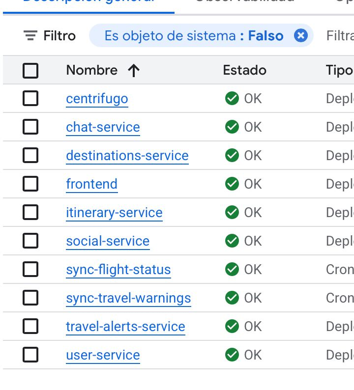
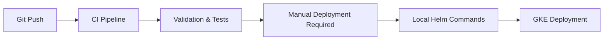

# Deployment Guide

This guide covers local development setup and production deployment to Google Kubernetes Engine (GKE).

---

## Local Development

### Quick Start

```bash
# 1. Configure environment
cp .env.example .env
# Edit .env with your Firebase credentials

# 2. Start all services
docker compose up -d

# 3. Access the application
# Frontend: http://localhost:5173
# API docs: http://localhost:8001/docs
```

### Services

- Firebase emulators (Auth, Firestore, Storage)
- PostgreSQL 15
- Centrifugo WebSocket
- 7 microservices with hot-reload

### Running Locally

```bash
docker compose up
```

Services available at:
- Frontend: http://localhost:5173
- User Service: http://localhost:8001
- Itinerary Service: http://localhost:8002
- Chat Service: http://localhost:8003
- Social Service: http://localhost:8004
- Travel Alerts Service: http://localhost:8005
- Destinations Service: http://localhost:8006
- Centrifugo: http://localhost:8443

## Production (GKE)

<p align="center">
  
</p>

*All services running in GKE with OK status*

### Infrastructure

- **GKE Autopilot cluster** - Managed Kubernetes with automatic scaling
- **Cloud SQL PostgreSQL** - Managed relational database
- **Firestore Native Mode** - NoSQL document database
- **Cloud Storage** - Object storage for images
- **Namespaces**
  - Staging: `itinerario-staging`
  - Production: `itinerario-prod`

### Deployment Strategy



**Note:** Deployment to GKE is currently a **manual process**.

### CI/CD Pipeline

The system uses GitHub Actions workflows for validation and testing:

1. **CI Pipeline** (`.github/workflows/ci.yml`)
   - **Validation** - Code quality checks, linting, formatting
   - **Testing** - Unit and integration tests
   - **Building** - Docker image build and validation only (no push to registry)
   - **Security** - Safety and Bandit vulnerability scanning

2. **Deploy Pipeline** (`.github/workflows/deploy.yml`)
   - **Pre-deployment Checks** - Quick lint and test validation
   - **Docker Image Validation** - Build and verify Docker images
   - **Database Migrations** - Alembic migrations for PostgreSQL services
   - **Infrastructure Validation** - Terraform format and validate

### Helm Charts

Located in `helm/` directory:
- Common chart templates shared across services
- Service-specific values files (`values-staging.yaml`, `values-prod.yaml`)
- ConfigMap and Secret management
- Health check probes
- Resource limits for GKE Autopilot

### Manual Deployment Process

**Prerequisites:**

1. **Configure kubectl for GKE:**
   ```bash
   gcloud container clusters get-credentials itinerario-cluster \
     --region=europe-west1 \
     --project=YOUR_PROJECT_ID

   # Verify connection
   kubectl get nodes
   ```

2. **Build and push Docker images:**
   ```bash
   # Build and tag for registry
   docker build -t YOUR_REGISTRY/itinerario/user-service:v1.0 ./services/user-service
   docker build -t YOUR_REGISTRY/itinerario/itinerary-service:v1.0 ./services/itinerary-service
   # ... repeat for all services

   # Push to registry
   docker push YOUR_REGISTRY/itinerario/user-service:v1.0
   # ... repeat for all images

   # To deploy to your own registry, update helm/values-staging.yaml with:
   # imageRegistry: "YOUR_REGISTRY/itinerario"
   # image.tag: "v1.0"
   ```

3. **Configure secrets:**
   ```bash
   # Update Helm values with secrets
   vim helm/values-staging.yaml
   ```

**Deploy:**
```bash
# 1. Infrastructure validation (if needed)
terraform -chdir=infra plan -var-file=environments/staging.tfvars
terraform -chdir=infra apply -var-file=environments/staging.tfvars

# 2. Deploy with Helm
helm upgrade itinerario ./helm \
  --namespace itinerario-staging \
  --values helm/values-staging.yaml \
  --install

# 3. Verify rollout
kubectl rollout status deployment -n itinerario-staging
```

## Infrastructure as Code

**Terraform:** Single GKE Autopilot cluster with environment modules for databases, storage, and IAM.

**Location:** `/infra/`
- `main.tf` - Cluster, networking, APIs
- `modules/environment/` - Reusable environment resources (Cloud SQL, Firestore, Storage, IAM)
- `environments/*.tfvars` - Staging/prod configuration

**Usage:**
```bash
terraform -chdir=infra plan -var-file=environments/staging.tfvars
terraform -chdir=infra apply -var-file=environments/staging.tfvars
```

**What the module creates:**
- Cloud SQL PostgreSQL 15 (private IP)
- Firestore (Native mode)
- Cloud Storage bucket
- Service accounts with Workload Identity

State stored in GCS with `backend "gcs"` block in `main.tf`.
