# Itinerario - UI Documentation

Visual guide mapping screenshots to code implementation.

> **Note:** All file paths are relative to `services/frontend-service/src/`

---

## Quick Reference: All Screens

| Screen | Screenshot | Route | Component | Purpose |
|--------|-----------|-------|-----------|---------|
| **Home** | 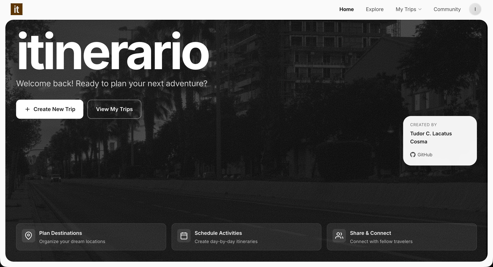 | `/` | `pages/home/Home.jsx` | Landing page with CTAs |
| **My Trips Menu** | 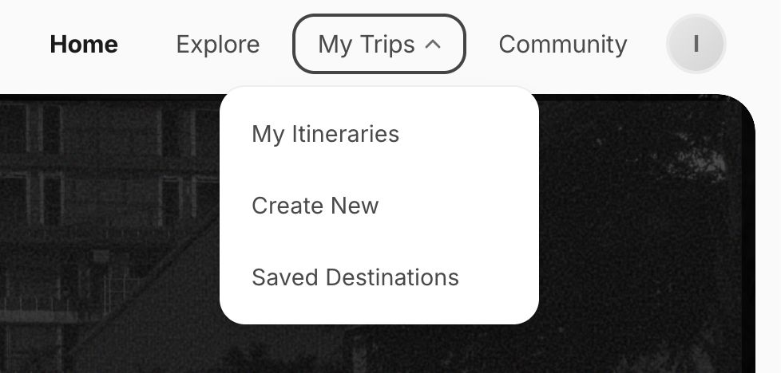 | Dropdown | `components/Navbar.jsx` | Access itineraries, create, destinations |
| **Profile Menu** | 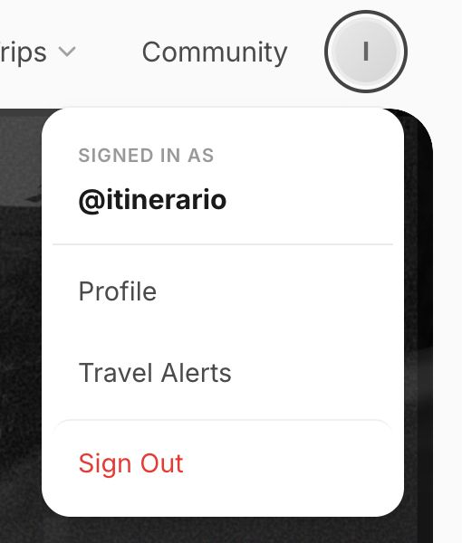 | Dropdown | `components/Navbar.jsx` | Profile, alerts, sign out |
| **Destinations List** | 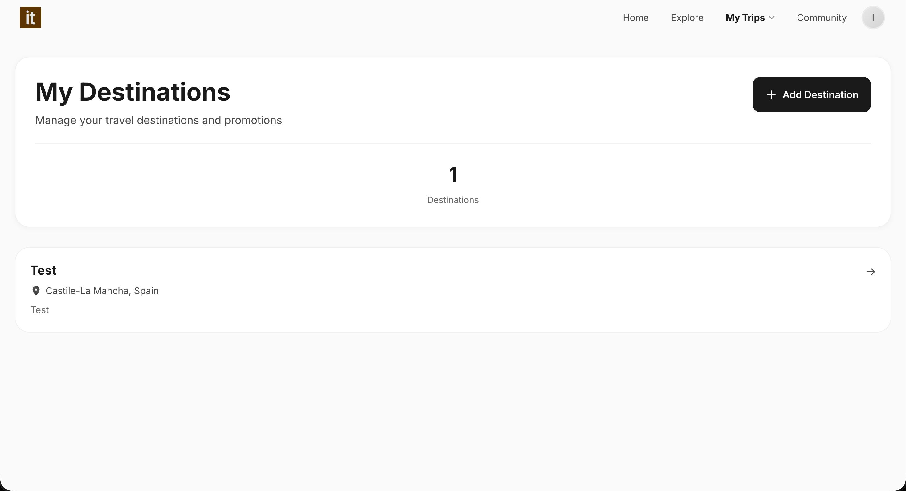 | `/destinations` | `pages/destinations/Destinations.jsx` | Manage saved destinations |
| **Destination Detail** | 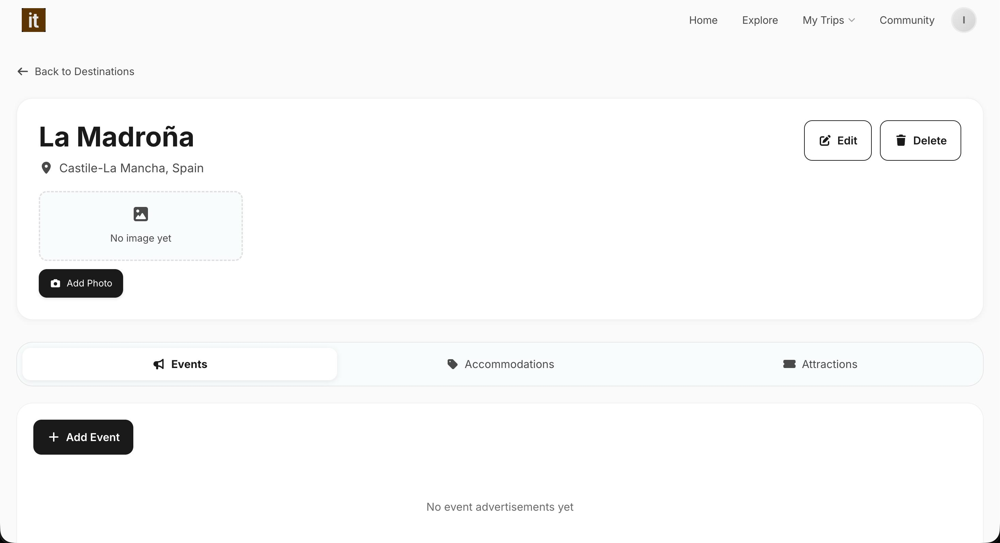 | `/destinations/:id` | `pages/destinations/DestinationDetail.jsx` | View destination with advertisements/offers/discounts |
| **Create Itinerary** | 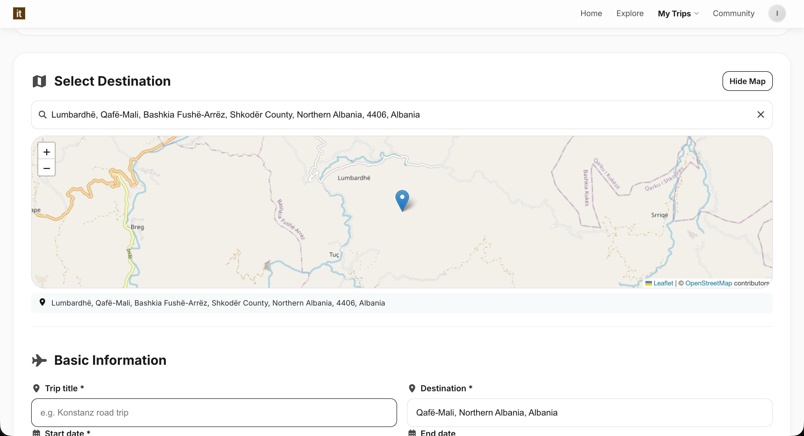 | `/itineraries/new` | `pages/itineraries/CreateItinerary.jsx` | Map-based trip creation |
| **Travel Warning** | 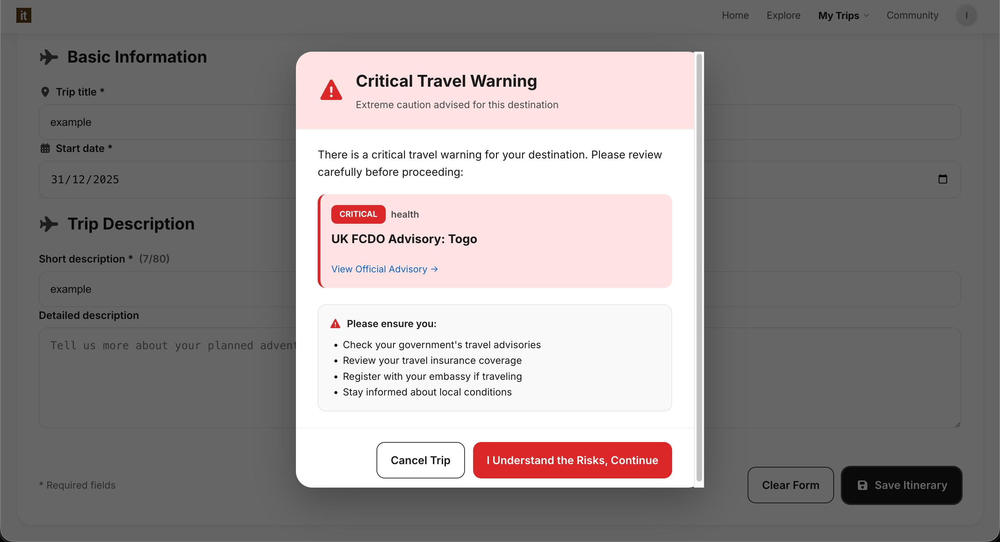 | Modal | `pages/itineraries/CreateItinerary.jsx` (inline) | Safety alert for advisories |
| **Travel Alerts** | 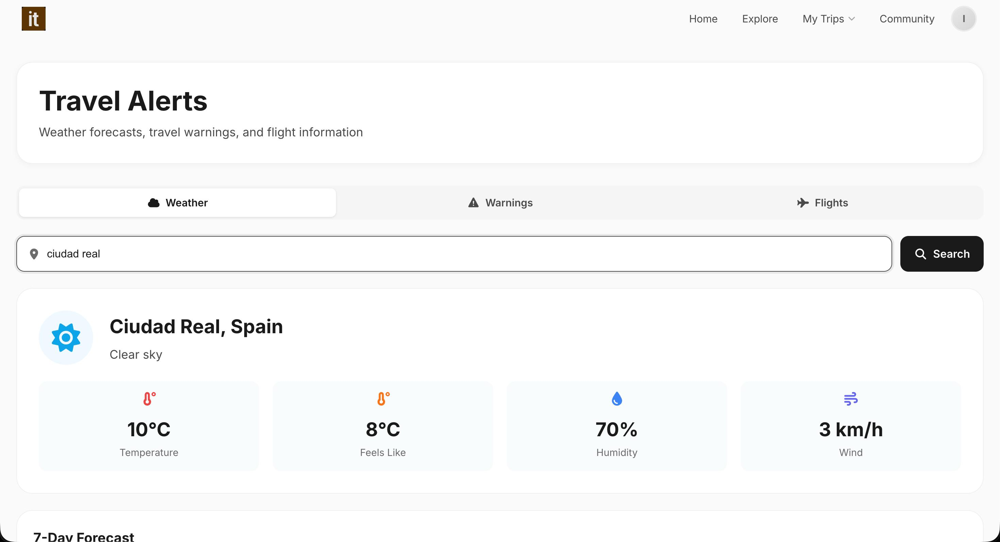 | `/travel-alerts` | `pages/travel-alerts/TravelAlerts.jsx` | Weather, warnings, flights |
| **Profile** | 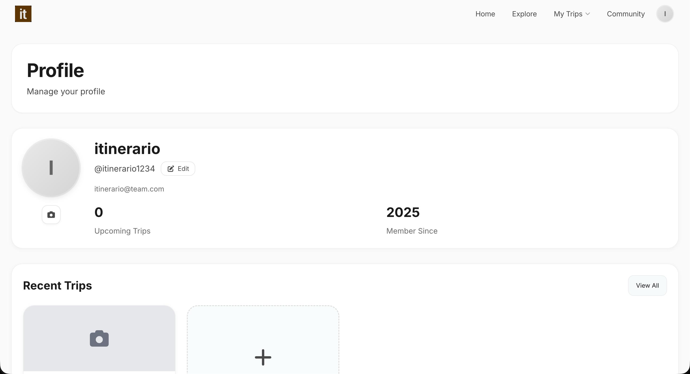 | `/profile` | `pages/profile/Profile.jsx` | User profile & stats |
| **Search** | 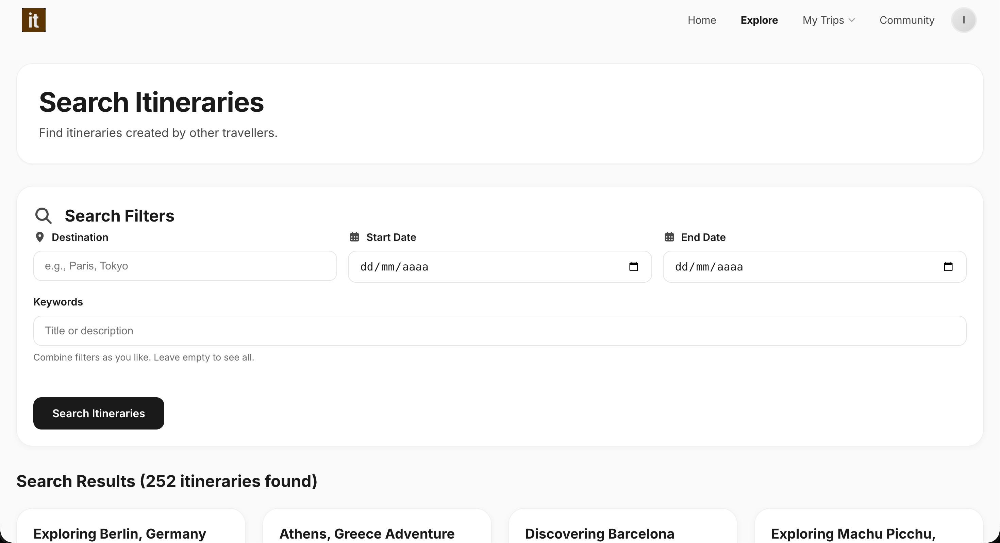 | `/search` | `pages/search/SearchTrips.jsx` | Find community itineraries |
| **Social** | 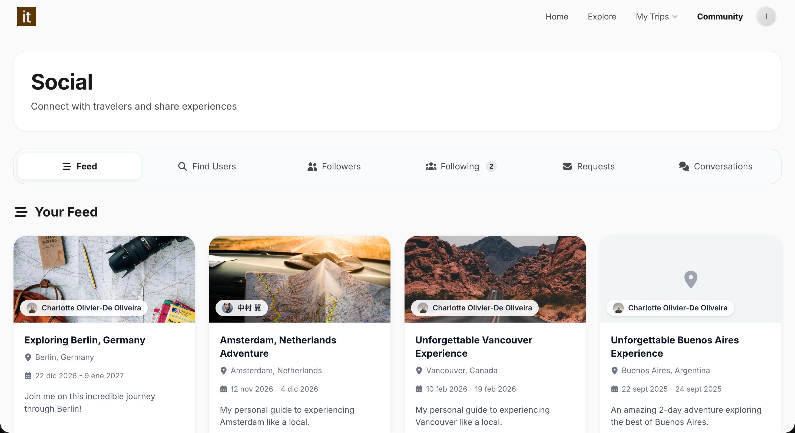 | `/social` | `pages/social/Social.jsx` | Community feed & chat |

---

## Navigation Structure

**Top Navbar** (`components/Navbar.jsx`)

```
Logo | Home | Explore | My Trips ▼ | Community | [Profile]
```

### My Trips Dropdown
- My Itineraries → `/itineraries`
- Create New → `/itineraries/new`
- Saved Destinations → `/destinations`

### Profile Dropdown
- Profile → `/profile`
- Travel Alerts → `/travel-alerts`
- Sign Out → `/logout`

---

## Screen Details

### 1. Home Screen


**Features**: Hero section, "Create New Trip" & "View My Trips" CTAs, feature cards (Destinations, Activities, Share), creator credits

**Route**: `/` → `pages/home/Home.jsx`

---

### 2. Destinations

#### List View


**Features**: Destination counter, "Add Destination" button, cards with name, location, description

**Route**: `/destinations` → `pages/destinations/Destinations.jsx`

#### Detail View


**Features**: Destination info, photo upload, tabbed content (Advertisements, Offers, Discounts), edit/delete

**Route**: `/destinations/:id` → `pages/destinations/DestinationDetail.jsx`

---

### 3. Itinerary Creation


**Features**:
- Interactive map (Leaflet/OpenStreetMap)
- Location search & pin
- Form: title, destination, dates, descriptions
- Clear form / Save itinerary buttons

**Route**: `/itineraries/new` → `pages/itineraries/CreateItinerary.jsx`

#### Travel Warning Modal


**Safety Feature**: Shows critical advisories when creating trips to risky locations
- Warning severity, source, category tags
- Actions: Cancel Trip / I Understand the Risks, Continue
- Safety checklist for user

---

### 4. Travel Alerts


**Features**:
- Location search
- 3 tabs: Weather, Warnings, Flights
- Weather cards: temp, feels like, humidity, wind
- 7-day forecast

**Route**: `/travel-alerts` → `pages/travel-alerts/TravelAlerts.jsx`

---

### 5. Profile


**Features**: Profile picture upload, display name, username, email, stats (Upcoming Trips, Member Since), Recent Trips section

**Route**: `/profile` → `pages/profile/Profile.jsx`

---

### 6. Search (Explore)


**Features**:
- Filters: destination, date range, keywords
- Results counter (e.g., "252 itineraries found")
- Horizontal scrolling cards with image, title, location, dates, author

**Route**: `/search` → `pages/search/SearchTrips.jsx`

---

### 7. Social (Community)


**Features**:
- Tabs: Feed, Find Users, Followers, Following (count), Requests, Conversations
- Feed cards: destination image, user avatar, title, location, dates, description
- Engagement: likes, comments

**Route**: `/social` → `pages/social/Social.jsx`

**Sub-components**:
- `components/Feed.jsx` - Chronological post feed
- `components/UserCard.jsx` - User discovery
- `components/ItineraryCard.jsx` - Shared itineraries
- `components/ChatWindow.jsx` - Real-time messaging
- `components/ConversationsList.jsx` - Active conversations

---

## Technical Overview

### Frontend Stack
- React 19.1.1 + Vite 7.1.7
- React Router v7.9.4 for routing
- Leaflet 1.9.4 for maps
- Firebase SDK 12.4.0+ for auth
- Context API for state management

### Component Tree
```
App.jsx
├── Navbar.jsx (persistent top nav)
└── Pages/
    ├── home/Home.jsx
    ├── search/SearchTrips.jsx
    ├── itineraries/
    │   ├── Itineraries.jsx
    │   ├── CreateItinerary.jsx
    │   ├── ItineraryDetail.jsx
    │   └── EditItinerary.jsx
    ├── destinations/
    │   ├── Destinations.jsx
    │   ├── DestinationDetail.jsx
    │   ├── CreateDestination.jsx
    │   └── EditDestination.jsx
    ├── profile/Profile.jsx
    ├── social/
    │   ├── Social.jsx
    │   └── components/ (Feed, UserCard, ItineraryCard, ChatWindow, ConversationsList)
    ├── travel-alerts/TravelAlerts.jsx
    └── auth/ (Login, Register, Logout)
```

---

## Design Patterns

**UI Elements**
- Card-based layout with rounded corners
- Consistent icons (location pins, calendars, action icons)
- Color scheme: black/dark gray primary, white secondary, red for warnings
- Empty states with clear CTAs
- Modal dialogs for critical info (travel warnings)

**Navigation**
- Persistent top navbar with dropdowns
- "Back to [Page]" links in detail views
- Browser history support (React Router)
- Tabbed interfaces for organizing content
- Horizontal scrolling for card lists
